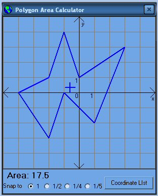



## Polygon Area Calculator \- Calculates the Area of any Polygon

### Description

This is just a minor rework of a program submitted 6 months ago by andy. I have replaced the area calculation method with one that is a bit simpler, and not limited to convex polygons. It was also easy to add in a calculation to display the centroid of the polygon.
 
### More Info
 

             |
---                |---
**Submitted On**   |2004-04-30 23:56:26
**By**             |[Gary Crowell](https://github.com/Planet-Source-Code/PSCIndex/blob/master/ByAuthor/gary-crowell.md)
**Level**          |Intermediate
**User Rating**    |5.0 (15 globes from 3 users)
**Compatibility**  |VB 4\.0 \(32\-bit\), VB 5\.0, VB 6\.0
**Category**       |[Graphics](https://github.com/Planet-Source-Code/PSCIndex/blob/master/ByCategory/graphics__1-46.md)
**World**          |[Visual Basic](https://github.com/Planet-Source-Code/PSCIndex/blob/master/ByWorld/visual-basic.md)
**Archive File**   |[Polygon\_Ar173940512004\.zip](https://github.com/Planet-Source-Code/gary-crowell-polygon-area-calculator-calculates-the-area-of-any-polygon__1-53492/archive/master.zip)

